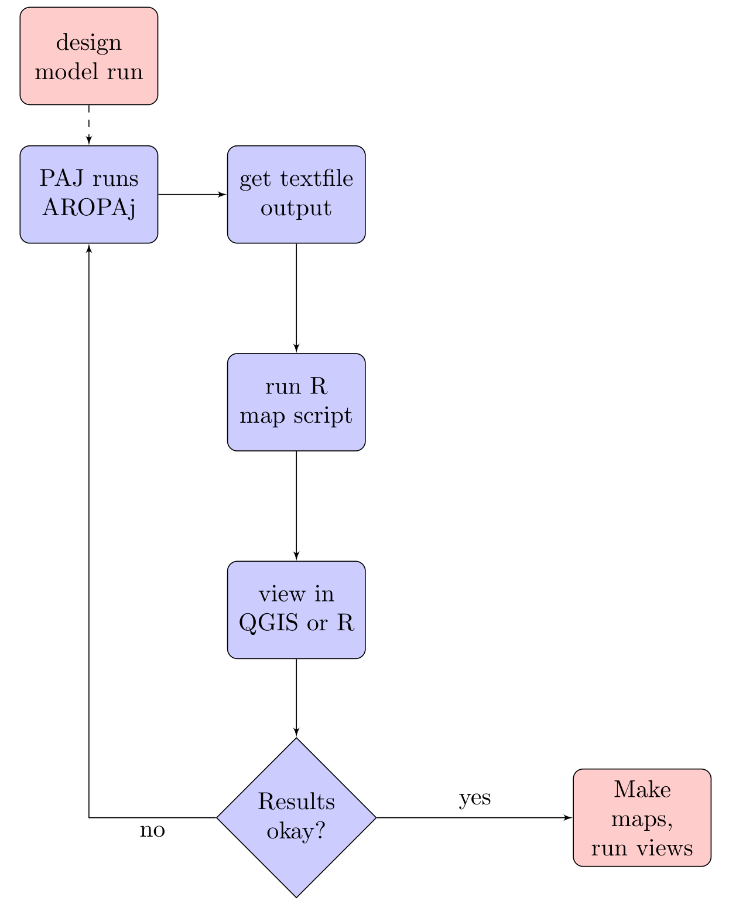

# Build database for landuse / landcover spatial dataset 

This repo was developed under API-SMAL project to combine RPG data, CLC data, and AROPAj output data for a basis of inter-disciplinary, inter-dept models and scenarios.

### Goals at first go:

1. load CLC vector files by year
2. load pre-processed PRA files (ilot files containing geom objects, culture files) by year
3. combine / subsample them in a clever, representative way that persists across scales (PRA: 900 km2 scale; Département: 6 000 km2 scale; Region 30 000 km2 scale)
4. load AROPAj spatialized data
5. adjust land use by model output

### Adjusted goals:

1. load AROPAj spatialized data
2. use scenario model results as baseline land use / landcover

We're taking pixel data from the aropaj output files (table.compil), adding them to the project database, then running Views in postgresql to general land use tables and / or maps.

{width=60%}

# {width=80%}


## Steps

Organize above objects in a postgresql database with postgis extension.

Summer 2019: it was decided in the June meeting to use AROPAj model output (land use / land cover "maps") as input to other models.

## General workflow : mapping aropaj outputs
0. maps of the "pixels" (shapes) of aropaj were previously loaded in postgis
-> apismal01admin/Databases/apismal01/Schema/public/{name based on the subsidy value}
-> Views to be made to visualize that reuniting different groups of crops in "formalisme commun" (currently a text file on Jeff's computer 09-10_script.sql), it is basically a view mapping the pixels from aropaj to "petites régions agricoles" (PRA). 
1. generation of aropaj data on aeropaj server (done by Jeff, see Pierre-Alain if need more information), done for all scenarios
-> ~/aropaj_tablecompil (current ones)
2. import those to postgis (R/04_aropaj-to-db.R)
-> can view them with http://138.102.84.194/browser/ (ex corentin.barbu@inra.fr/apismal2019)
-> apismal01admin/Databases/apismal01/Schema/tomap/Tables/
3. Map the results fo aropaj simulations by PRA, based on link defined on point 0. 
4. Summarize surface of each compoenent in the formalism commun by PRA or region. 
-> View, on Jeff computer
-> Can be given to Simon or Floriane to do the modelling (if needed jeff@jnorville.com)

## Spatialization workflow

1. update path to AROPAJ script storage (respect sense of ///)

2. run using "source" to get one file under "tomap" (as in, "to map") schema

3. 


  
## File inventory

The following list of R files are found under map/R directory:

01_load_postgis.R

02_load_restof_postgis.R

03_formalize

04_aropaj-to-db.R : main file to output the gis database, modified from 11 and 13

06_aropaj_to_db_output.R : Vincent's file to include emiss23T in output table

10_SpatiA_3_fonctn.R

11_SpatiA_4_spatialisation_des_sorties_aropaj.R - legacy reference 

12_SpatiA_4_spatialisation_LOCAL.R - mofified from file 11, above

13_SpatiA_5_mise_au_propre_des_tables_compil.R - legacy reference 

20_expACPbyPRAoptimized.R

21_acpLULCchange.R

99_sarsdataToMap.R

99_brouillon.R - tool to load (Windows) clipboard contents to postgresql db (cross platform???)

  
### Results:

1. when summing by region, CLC and RPG data are problematic
2. Some .RDA files appear to have wrong dataheaders
3. Appear to be missing departments I thought were already loaded (map, below)


### Standards

Following the convention recommendations here:

  https://richpauloo.github.io/2018-10-17-How-to-keep-your-R-projects-organized/


updated 8 october 2019 Jeff Norville

### naming convention

The shapefiles contain the probability that a given landuse (name of shapefile) is present on a given pixel (polygon within the shapefile) based on a hypothetical subsidy. 

Ex:
grassland_sub250.shp
 - landuse = grassland, this landuse combines permanent and temporary prairies
 - subsidy = 250, or €250 per hectare
 - range of values of each pixel from 0 to 1 *

### values
region - RICA/FADN region code
gridcode - pixel reference in aropaj (unique only within a region)
codepra - SAR or Petites régions agricoles
geom - geometry object NB these sum to Surface Agricole Utile, not the same as total surface area
grassland - likelyhood to occur on this pixel
simul - see below
importdtt - date added / replaced in database
aropajscript - model run script id


### addenda

shapefiles in this directory were generated directly from the postgresql/postgis database titled
api2 (the development database)
currently being copied into
apismal01 (a production version)

Minor differences may occur between the two.

The abbreviation "simul" refers to simulation; the model run these data are based on 25 simulated subsidies to increase conversion of cropland to prairie (for details see param-setups.xlsx under Dropbox\API-SMAL_Partage_Animation\Fiches_modeles\aropaj_plots). 
We've picked the following values for scenarios:
simulation 6 : subsidy = 0€ ; simulation 11 : subsidy = 250€/hectare; simulation 16 : subsidy = 500€/hectare; simulation 21 : subsidy = 750€/hectare; simulation 26 : subsidy = 1000€/hectare


* technically the max(grassland) value from grassland_sub250.shp is "1.00000000754551" ... however, precision beyond the 8th digit isn't significant on the system used to calculate these results.

### SQL for grassland_sub250.shp began as a table
```
CREATE TABLE grassland_sim11 AS (
SELECT grid.region, grid.gridcode, grid.codepra, grid.geom, (a.surfafsh) as grassland, a.simul, timestamp as importdtt, '190412130048_APISMALd2190920134434' as aropajscript
FROM public.dsgrid_pra2 grid
	LEFT JOIN tomap."190412130048_APISMALd2190920134434" a ON grid.gridcode = a."GRIDCODE"
	AND cast(grid.region as integer) = a.region
WHERE simul=11) ;
--gist indices are important for gis-speed performance in postgis but don't impact the shp files
CREATE INDEX idx_grassland_sim11 ON grassland_sim11
  USING GIST (geom);
```

