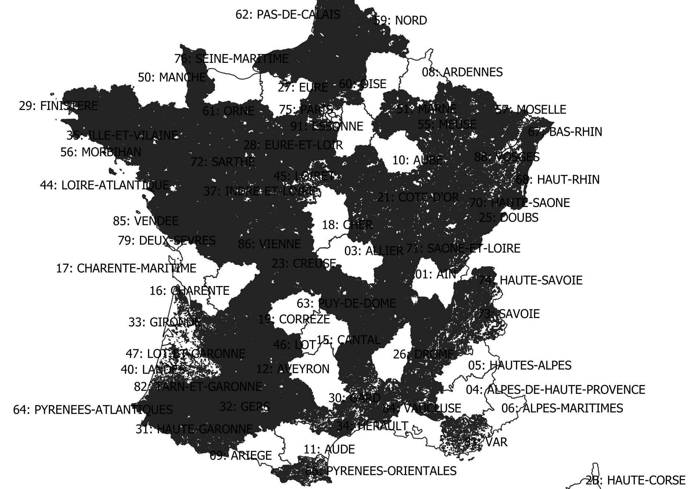
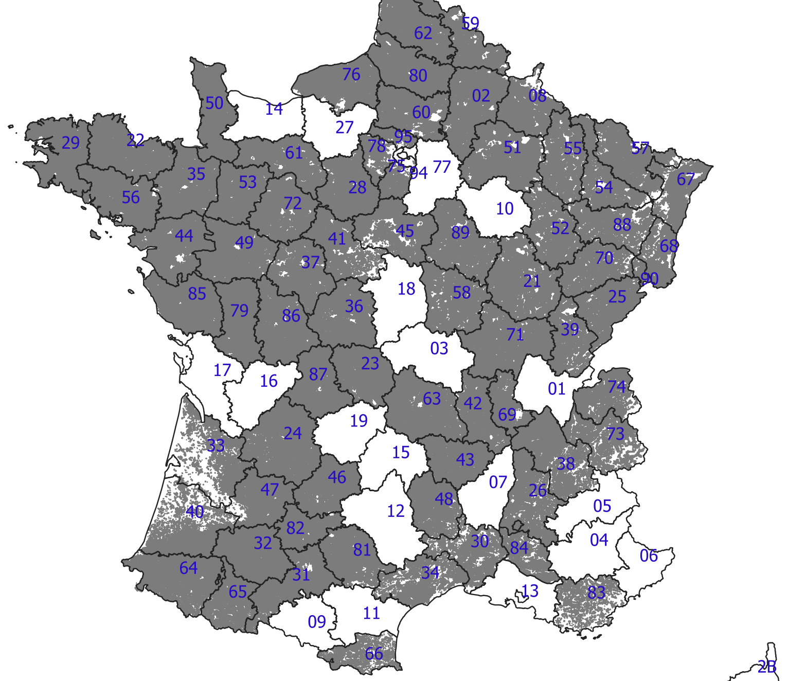

# Build database for landuse / landcover spatial dataset 

This repo was developed under API-SMAL project to combine RPG data, CLC data, and AROPAj output data for a basis of inter-disciplinary, inter-dept models and scenarios.

### Goals at first go:

1. load CLC vector files by year
2. load pre-processed PRA files (ilot files containing geom objects, culture files) by year
3. combine / subsample them in a clever, representative way that persists across scales (PRA: 900 km2 scale; Département: 6 000 km2 scale; Region 30 000 km2 scale)
4. load AROPAj spatialized data
5. adjust land use by model output

### Adjusted goals:

1. load AROPAj spatialized data
2. use scenario model results as baseline land use / landcover

So the 

{width=80%}

## Steps

Organize above objects in a postgresql database with postgis extension.

Summer 2019: it was decided in the June meeting to use AROPAj model output (land use / land cover "maps") as input to other models.

## General workflow : mapping aropaj outputs
0. maps of the "pixels" (shapes) of aropaj were previously loaded in postgis
-> apismal01admin/Databases/apismal01/Schema/public/{name based on the subsidy value}
-> Views to be made to visualize that reuniting different groups of crops in "formalisme commun" (currently a text file on Jeff's computer 09-10_script.sql), it is basically a view mapping the pixels from aropaj to "petites régions agricoles" (PRA). 
1. generation of aeropaj data on aeropaj server (done by Jeff, see Pierre-Alain if need more information), done for all scenarios
-> ~/aropaj_tablecompil (current ones)
2. import those to postgis (R/14_aropaj-to-db.R)
-> can view them with http://138.102.84.194/browser/ (jeff@jnorville.com/apismal2019)
-> apismal01admin/Databases/apismal01/Schema/tomap/Tables/
3. Map the results fo aropaj simulations by PRA, based on link defined on point 0. 
4. Summarize surface of each compoenent in the formalism commun by PRA or region. 
-> View, on Jeff computer
-> Can be given to Simon or Floriane to do the modelling (if needed jeff@jnorville.com)

  
## File inventory

The following list of R files are found under map/R directory:

01_load_postgis.R

02_load_restof_postgis.R

03_formalize

04_animation

10_SpatiA_3_fonctn.R

11_SpatiA_4_spatialisation_des_sorties_aropaj.R - legacy reference 

12_SpatiA_4_spatialisation_LOCAL.R - mofified from file 11, above

13_SpatiA_5_mise_au_propre_des_tables_compil.R - legacy reference 

14_aropaj-to-db.R : main file to output the gis database, modified from 11 and 13

20_expACPbyPRAoptimized.R

21_acpLULCchange.R

99_sarsdataToMap.R

99_brouillon.R - tool to load (Windows) clipboard contents to postgresql db (cross platform???)

  
### Results:

1. when summing by region, CLC and RPG data are problematic
2. Some .RDA files appear to have wrong dataheaders
3. Appear to be missing departments I thought were already loaded (map, below)

### Standards

Following the convention recommendations here:

  https://richpauloo.github.io/2018-10-17-How-to-keep-your-R-projects-organized/
